

  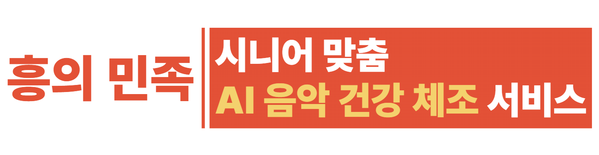

 

 

## 📖 프로젝트 개요

**음성인식 기반으로 어르신의 여가 생활을 보조하고 응급 상황에 대응하는 돌봄 시스템**

 

## 🚀 주요 기능

  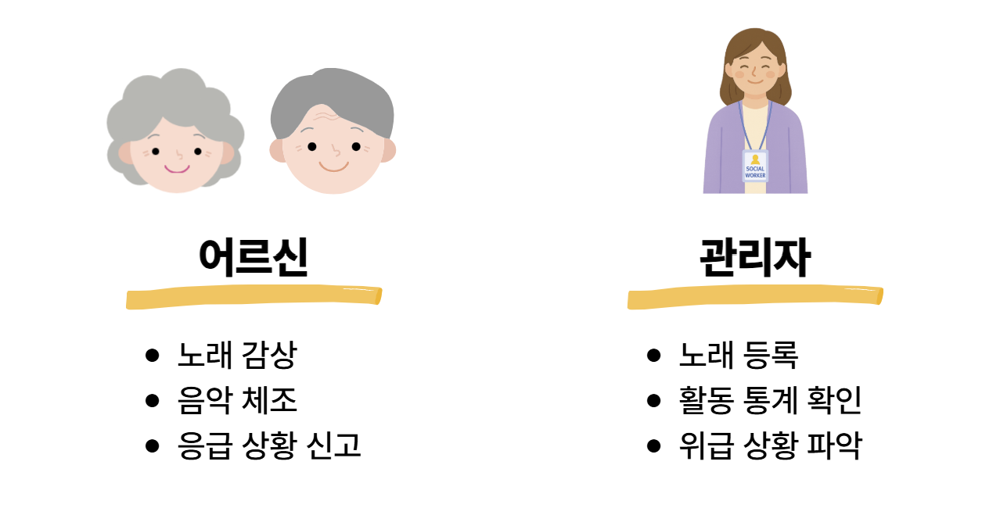

### 1. 음성 명령을 통한 주요 기능 제어
> "흥민아" 라는 호출어로 시스템을 활성화하고, 직관적인 음성 명령으로 모든 기능을 손쉽게 제어

-   **음악 재생**: "송대관 유행가 틀어줘" 와 같이 가수와 노래 제목을 말하면 음악을 즉시 재생
-   **간편한 제어**: "그만 들을래" 등 간단한 명령으로 기능 정지

  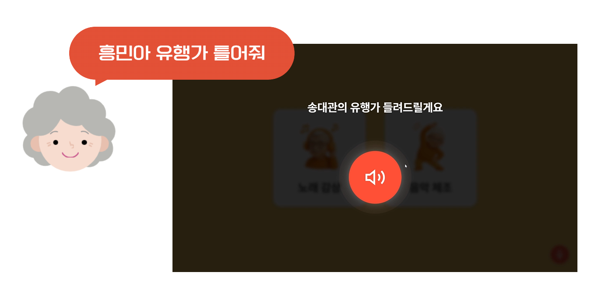

### 2. AI 동작 인식을 활용한 음악 체조 게임
> "체조할래" 음성 명령으로 시작되는 인터랙티브 건강 관리 콘텐츠
  
-   **실시간 동작 분석**: 카메라를 통해 사용자의 체조 동작을 실시간으로 인식하고 AI 모델로 정확도 분석
-   **동적 난이도 조절**: 사용자의 점수에 따라 다음 동작의 난이도가 자동으로 조절되어 흥미와 참여를 유도
-   관리자 대시보드에서 어르신 정보 확인
  

  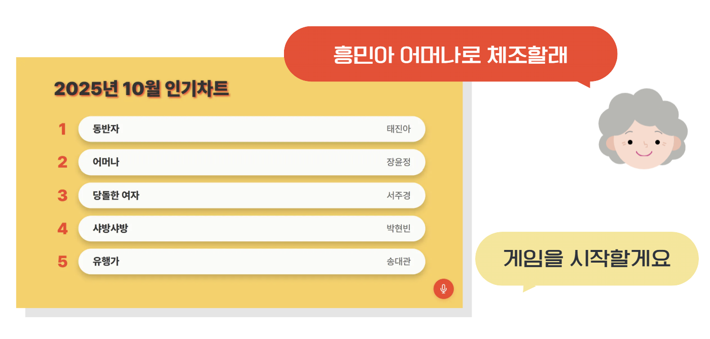

  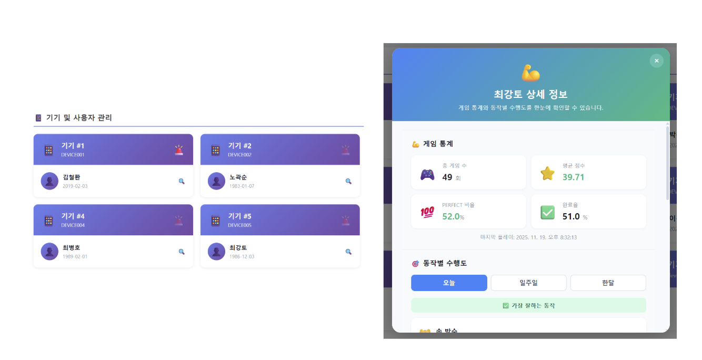

### 3. 응급 상황 감지 및 신속 알림
> "살려줘" 와 같은 위급 상황을 암시하는 음성을 감지하여 신속하게 대응

-   **응급 호출**: 특정 키워드 감지 시, 사전에 등록된 관리자에게 SMS 또는 앱 알림을 자동으로 발송
-   **이력 관리**: 관리자 대시보드에서 응급 상황 발생 이력을 조회하고 관리
  

  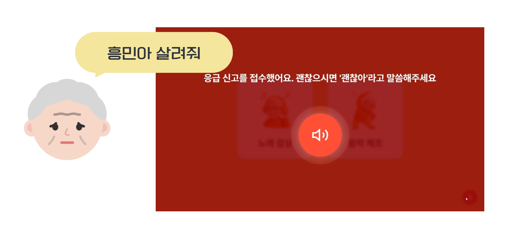

  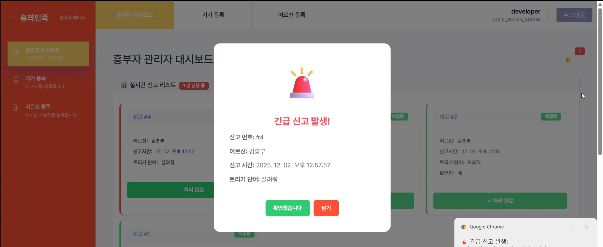

 

## 사용 기술

  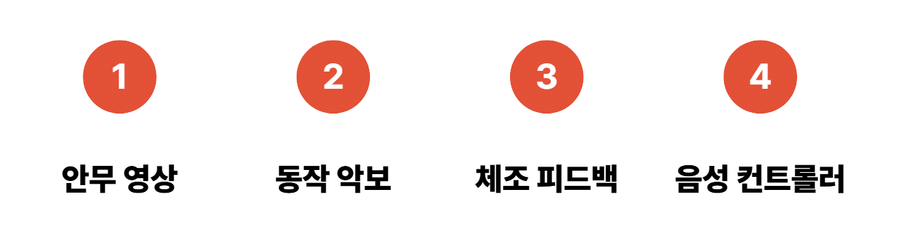

 

### 1. 안무 영상
> 어르신이 보고 따라하실 수 있도록 체조 시범을 보이는 캐릭터 영상 제작

  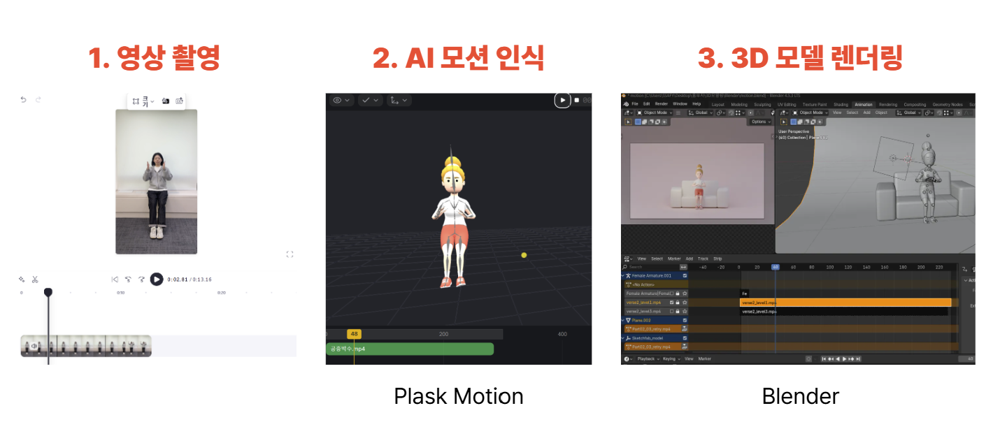

  
### 2. 동작 악보
> 노래의 박자에 맞게 체조 동작이 나오도록 하기 위해 동작 악보 제작

  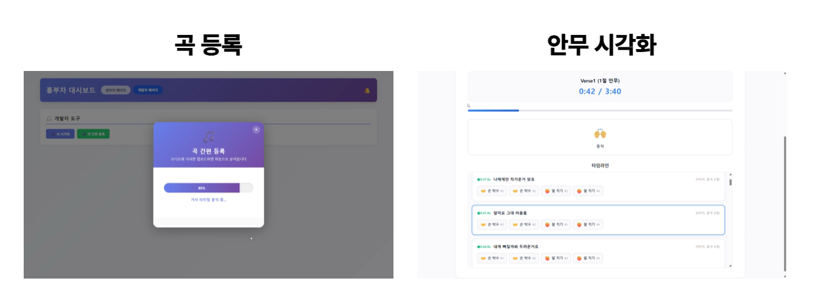

  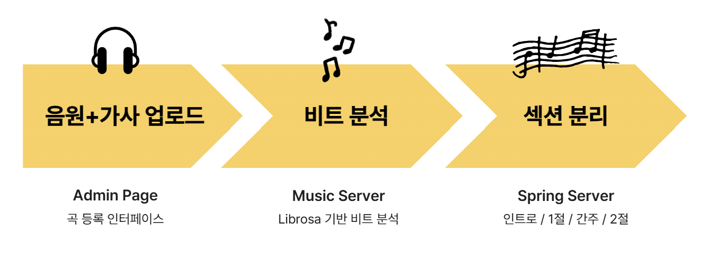

  
### 3. 체조 피드백
> 사용자가 동작을 잘 따라하고 있는지 실시간으로 피드백 후 1절 점수를 바탕으로 2절 동작 난이도를 동적으로 조절

  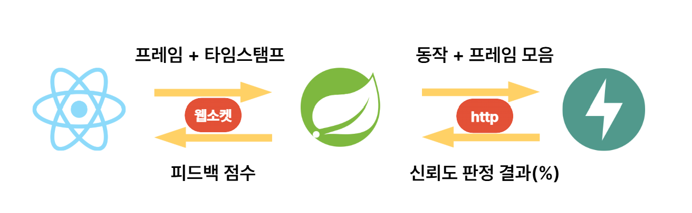

  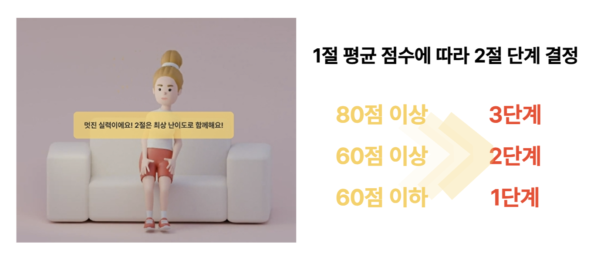

  

  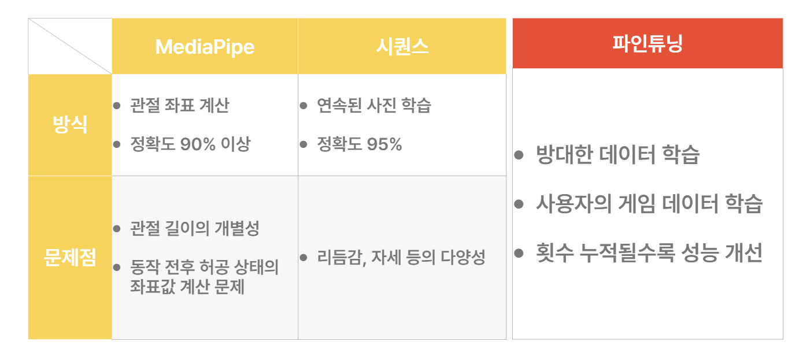

  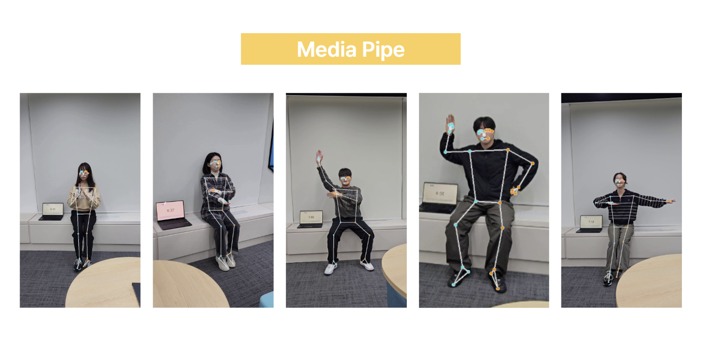

  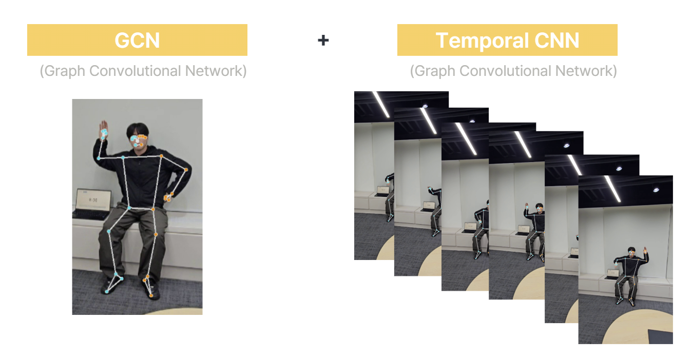

### 4. 음성 컨트롤러
> 사용자의 음성을 분석하여 기능 실행

  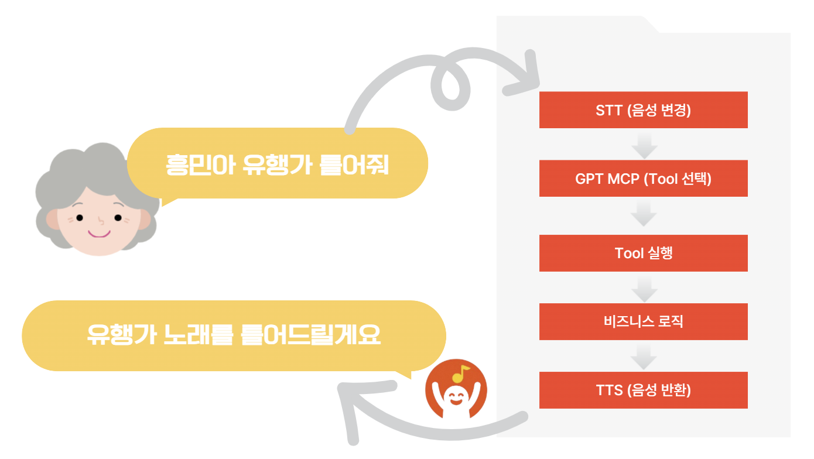

  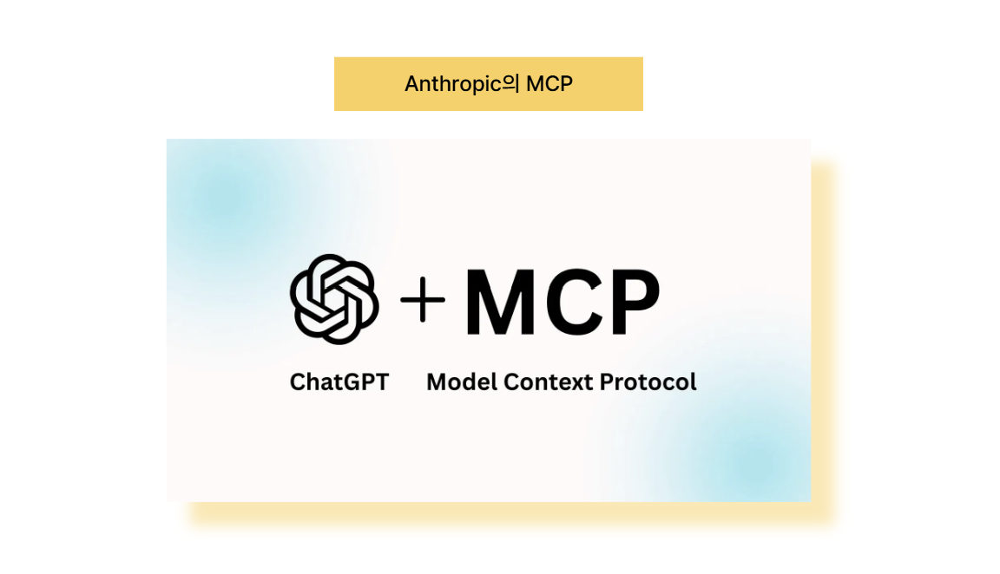

  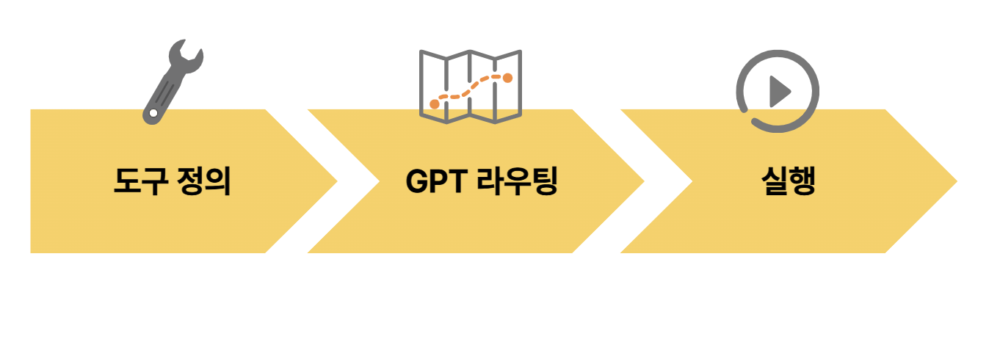

  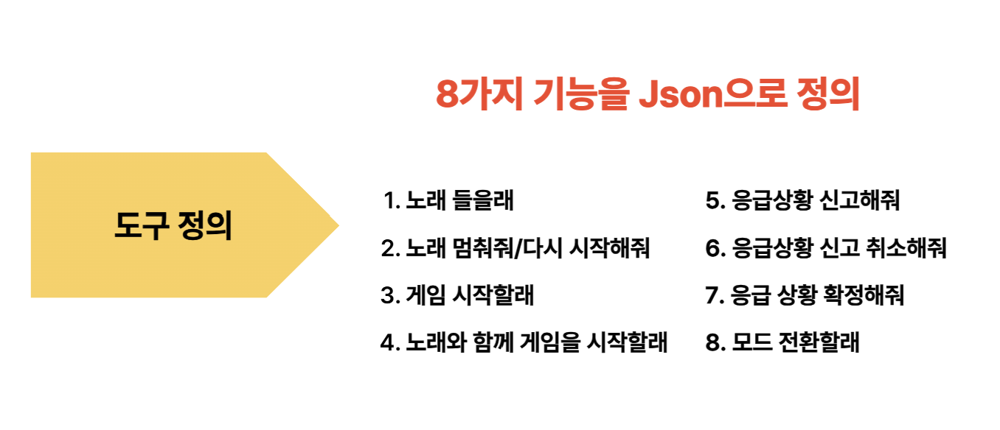

  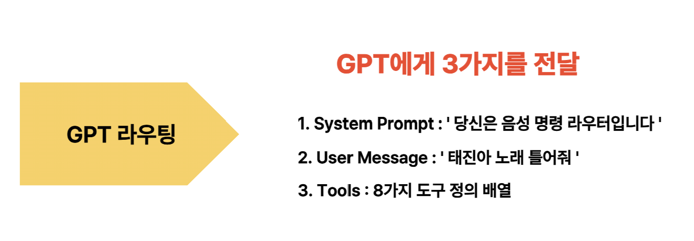

  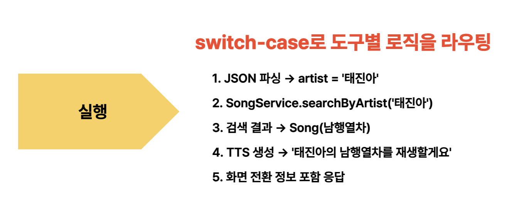

## 사용자 베타 테스트 후기

  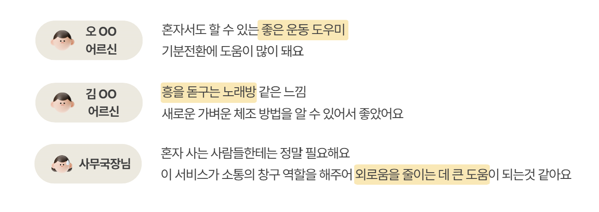

 

## 🛠️ 기술 스택 

| 구분                | 기술                                                                     |
| :------------------ | :----------------------------------------------------------------------- |
| **Frontend**        | `React`, `Vite`, `React Router`     |
| **Backend**      | `Spring Boot`, `Java 17`, `Spring Security`, `JWT`, `JPA`                                |
| **AI / VUI**         | `Python`, `OpenCV`, `MediaPipe`, `Picovoice`, `GPT`                   |
| **Database**        | `MySQL`, `Redis`, `Mongo DB`                                                                  |
| **Infra**           | `AWS`, `Docker`, `Nginx`                                                   |

 

## 👨‍💻 팀원 (Team 흥마법사)

| 이름     | 역할              |
| :------- | :---------------- | 
| **이지민** | **팀장, Backend, AI**  | 
| **김선민**   | **Frontend**        |
| **박재은** | **Frontend**        |
| **윤현석** | **Backend, AI**    |
| **이영우** | **Infra**      |
| **장수연** | **Backend, Embedded**     |
